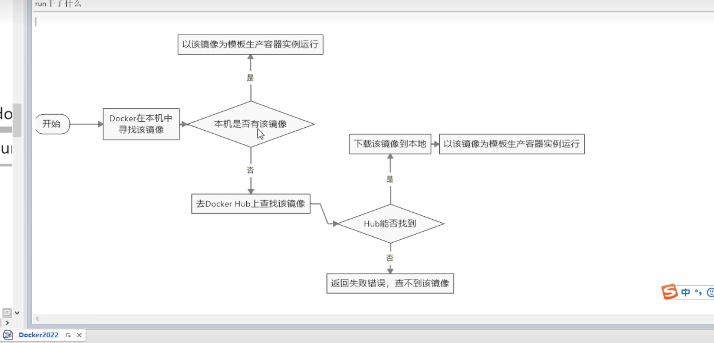

# Docker 是什么
 容器虚拟化技术
# Docker 能干嘛
 统一版本 解决环境不一样导致的代码不能运行
 Docker就可以系统平滑移植 
# 容器和虚拟机的区别
虚拟机的缺点 
 - 资源占用多
 - 冗余步骤多
 - 启动慢
容器
 - 轻量
 - 启动快

# devops
 开发/运维 

# 镜像的图解

# docker的三要素
 - 镜像 [类模板]
   - 
 - 容器 [类的实例对象]
   - 
 - 仓库 [储存实例对象的地方]
   - 

仓库  容器      镜像 
Book b1 = new Book();

Redis r1 = docker run镜像; 这就是一个容器实例 也就是一个集装箱

# docker的架构图
 - docker在执行 run pull build时 docker的后台线程会去本地检查是否存在对应的image 
   - 如歌没有那么就去仓库里面寻找并且创建到本地 最后放入容器中
   - 如果有那么就直接使用本地镜像 并且放入容器中
 - 架构图
 - 
# docker的工作原理
Docker也是一个CS的结构 Docker的守护进程运行在主机上
然后通过Socket链接从客户端访问 守护进程从客户端接受命令 并管理运行在主机上的容器 
**容器是一个运行时环境就是所谓的"集装箱" 可以对比mysql**

# 架构图

# 阿里云加速

## docker的镜像查找路径

如果本机有对应的镜像 则直接使用 否则从远程拉取

# docker和虚拟机的区别的图解

# docker的常用命令
 - 1 帮助启动类命令
   - 
   - docker 帮助命令
     - docker run -help 帮助文档
 - 2 镜像命令
   - docker images 查看所有的镜像
     - 表头的信息
       - repository 表示仓库的镜像源
       - TAG 镜像的标签版本号
       - IMAGE ID 镜像ID
       - CREATED 镜像创建时间
       - SIZE 镜像大小
   - docker search 某个镜像名字 [--limit 5]   
     - 从远程库查找
   - docker pull 某个镜像名字[:版本号]
     - 从远程拉取
   - docker system df 查看镜像大小 
     - 查看容量
   - docker rmi 容器镜像ID 
     - 删除
   - docker的虚悬镜像是什么
     - none的镜像 后期高级篇解读
 - 3 容器命令
   - 
 - 4 小总结

## docker的容器运行结构

# docker运行镜像
 docker run [OPTION]IMAGE[COMMAND][ARG...]
OPTION的可选项
 --name = "容器名字" 为容器指定一个名称
 -d: 后台执行 [也就是开启一个守护进程]
-i 以交互式的方式运行容器 一般和-t一起使用
-t 为容器重新分配一个伪输入终端 通常和i一起使用
也就是启动一个交互式容器 (前台有伪终端 等待交互)
-P 随机端口映射 大写P
-p 指定端口映射 小写p
-a 列出当前所有正在运行的容器 + 历史上运行的容器
-l 显示最近创建的容器
-n 显示最近n个创建的容器
-q 静默模式 只显示容器编号
docker run -it --name=myubuntu1 /bin/bash

在终端中 使用exit\ctrl+p+q退出终端
# 查看容器进程ps
docker ps
# 操控运行中的容器的方法
重启容器
 - docker restart 容器ID/容器名
停止容器
 - docker stop 容器ID/容器名
强制停止容器
 - docker kill 容器ID/容器名

## docker的一个坑
 关于centenos启动后 通过 docker ps -a 查看 没有看到容器进程
 [docker容器后台运行 必须也要有一个前台进程 可以通过-it解决]

# docker 打印log
docker logs [option] 容器ID
# docker 查看容器中运行的进程信息，支持 ps 命令参数
docker top 容器ID\
# docker inspect : 获取容器/镜像的元数据。

# 如何进入一个后台镜像
 - docker exec [OPTION] ID 指令
   - option 
     - -d 分离模式 后台运行
     - -i 交互式
     - -t 伪终端
       docker exec -it  2131a3234bc2 /bin/bash
 - docker attach 容器ID
 - 这两个方法的使用和效果是一样的 但是 attach的容器退出时 会关闭容器进程 exec不会
 
两个方法
# /bin/bash /bin/sh
意思是运行镜像的/bin/bash or sh 应用 用于启动终端
 
# 新老技术对比

# 将容器的文件 移入主机中使用
 docker cp 容器ID:容器内路径 目的主机路径
#  导出容器
 export导出容器的内容作为一个tar包 
 import从tar包中的内容创建一个新的文件系统在导入为镜像
docker export 容器id > 文件名.tar
cat 文件名.tar|docker import - 镜像名:镜像版本号
引入之后 就会将其放入images 

# docker 的常用命令图

# 镜像
 是一个种轻量级 可执行的独立软件包 它包含运行某个软件所需的环境 我们将其打包成一个运行环境 这个文件就是一个images镜像
[只有通过images docker才能生成容器实例 类似java的new一个对象]

# 镜像的结构
 - UnionFS[联合文件系统] 
   - 

# commit命令
 docker commit 提交容器使其成为一个新的镜像

docker commit 提交容器的副本 使其成为一个新的镜像
docker commit -m ="提交的描述信息" -a="作者" 容器ID要创建的目标镜像名:[标签名]

commit后 会将其容器打包为一个images

## 将其镜像放入阿里云仓库
- 登录
docker login --username=帅鹏程 registry.cn-hangzhou.aliyuncs.com
- docker tag 用于给镜像打标签，语法如下：
  - docker tag 镜像ID 仓库地址:仓库的版本号
docker tag [ImageId] registry.cn-hangzhou.aliyuncs.com/m_isaka/ubuntu:[镜像版本号]
- 推送 
  - docker push 仓库地址:要推送的版本号
docker push registry.cn-hangzhou.aliyuncs.com/m_isaka/ubuntu:[镜像版本号]

# docker的私有仓库
Docker pull Registry
 - 安装完毕后 执行这行代码
docker run -d -p 5000:5000 -v /zzyyuse/myregistry/:/tmp/registry --privileged=true registry

# 容器数据卷 Docker持久化
 - 为什么
   - docker在使用镜像的时候 如果产生了数据 但是不commit 则在关闭容器时 数据会丢失
   - 为了能够持久化数据 所以要使用卷 [卷就是目录或文件，存在于一个或多个容器中，由Docker挂载到容器，但卷不属于联合文件系统（Union FileSystem），因此能够绕过联合文件系统提供一些用于持续存储或共享数据的特性:。]
   
 - 一个坑
   - Docker挂载主机目录访问如果出现cannot open directory :Permission denied 解决方案
   - --privileged=true参数即可

 - docker容器卷的原理  就是将容器的映射目录+数据备份+持久化 放到本地宿主机的目录中

# 如何使用容器数据卷
[:冒号 映射的意思]
 docker run -it --privileged=true -v /宿主机绝对路径目录:/容器内目录 镜像名
 [数据卷就是将你指定的容器目录中的内容 放在指定的宿主机路径中]
 比如你在指定的目录中创建一个文件 他会[实时]的同步到宿主机的路径中 反之亦然
 - 特点
 - 

# docker inspect 容器ID 可以查看容器数据卷目录
 Mount属性

退出容器后 重启只要依旧带上参数 即可做到数据回复

## 权限
docker run -it --privileged=true -v /宿主机绝对路径目录:/容器内目录:[rw/ro] 容器ID   
    - rw:read write 可读可写   ro: read only 只读 

## 容器卷的继承
如何容器二继承容器1的规则
[-v ==== --volumes-from]
docker run -it --privileged=true [--volumes-from] 父类 [--name xx] 容器ID
docker run -it --privileged=true --volumes-from u1 --name u2 ubuntu
继承U1的ubuntu容器卷规则
 并且就算u1这个容器被卸载 u2照样可以运行 因为两个容器是独立的 u2只是继承了u1的规则

# docker 安装软件的总体步骤
- java技术栈
  mysql 
  redis 
  rabbitMq ...

# docker 容器安装的步骤
- 搜索镜像
- 拉去镜像
- 查看镜像
- 启动镜像
  - 服务端口映射
- 停止镜像
- 移除容器

# tomcat 8080端口的问题
 - 404
   - 因为最新的tomcat的文件夹目录的webapps改名为了webapps.dist 所以要修改一下文件名
 - 免修改的版本
   - billygoo/tomcat8-jdk8 这个镜像 不用修改webapps

# 安装mysql
  
# mysql的执行命令
[-e 环境的缩写 -d 守护线程]
 docker run -e MYSQL_ROOT_PASSWORD=密码 -d mysql:tag

# mysql运行
 先运行mysql
  docker run -p 3306:3306 -e MYSQL_ROOT_PASSWORD=密码 -d mysql:5.7
 然后进入mysql容器
  docker exec -it 容器ID /bin/bash
 最后运行mysql指令
  mysql -uroot -p密码 
 
## mysql如何做数据持久化 使用容器数据卷
[
-d 后台运行
-p 指定端口
-e 设置环境
--privileged=true 开启读取目录权限
-v 设置映射 == --volumes-from
-v 宿主机地址:要映射的容器地址
--name 容器别名
]
 docker run -d -p 3306:3306 -e MYSQL_ROOT_PASSWORD=123456 --privileged=true -v /opt/mysql/log:/var/log/mysql -v /opt/mysql/conf:/etc/mysql/conf.d -v /opt/mysql/data:/var/lib/mysql --name=mysql mysql:5.7

## 为什么容器无法添加中文数据
因为dokcer 安装完后 Mysql并且run出容器后 建议请先修改完字符集编码后 在新建Mysql表

## docker 的容器一旦创建就可以一直使用 并且通过docker ps -a 查看
  启动一个关闭的容器
   docker start 容器ID
  
## docker run redis
  进入redis容器中后 使用redis-cli 进入操控界面
  
# redis的容器数据卷 实现数据持久化 
  - 找到redis的配置文件 
    - 现在宿主机中创建一个 /app/redis 的文件夹

# docker 运行redis的指令
docker run -p 6379:6379 --name redis --privileged=true -v /app/redis/redis.conf:/etc/redis/redis.conf -v /app/redis/data:/data -d redis:6.0.8 redis-server /etc/redis/redis.conf

# 高级篇
 docker 复杂安装
 
# mysql主从复制 
  - docker主机的执行命令
  - docker run -p 3007:3306 --name mysql_main --privileged=true -v /opt/mysql_master/log:/var/log/mysql -v /opt/mysql_master/conf:/etc/mysql/conf.d -v /opt/mysql/data:/var/lib/mysql -e MYSQL_ROOT_PASSWORD=123456 -d mysql:5.7
  - docker mysql宿主创建完毕后在Conf文件夹中创建my.cnf
    - my.cnf内容
    `
      [mysqld]
      #[必须]主服务器唯一ID
      server-id=1

       #[必须]启用二进制日志,指名路径。比如：自己本地的路径/log/mysqlbin
      log-bin=atguigu-bin   
      #[可选] 0（默认）表示读写（主机），1表示只读（从机）
      read-only=0

      #设置日志文件保留的时长，单位是秒
      binlog_expire_logs_seconds=6000
      
      #控制单个二进制日志大小。此参数的最大和默认值是1GB
      max_binlog_size=200M
      
      #[可选]设置不要复制的数据库
      binlog-ignore-db=test
      
      #[可选]设置需要复制的数据库,默认全部记录。比如：binlog-do-db=atguigu_master_slave
      binlog-do-db=需要复制的主数据库名字
      
      #[可选]设置binlog格式
      binlog_format=STATEMENT
    - 

    - mysql里面创建一个数据同步账户
    - CREATE USER 'slave'@'%' IDENTIFIED BY '123456';
    - GRANT REPLICATION SLAVE,REPLICATION CLIENT ON *.* TO 'slave'@'%';
    - 创建新的一个容器作为从机
    - 从机配置my.cnf 
    - 查看主从复制同步状态 show master status; 
    - 13:12
    - 在从机配置
    -                                              主机用户[上面已经创建了]  用户密码                  端口                       
      - change master to master_host="宿主机IP",master_user='slave',master_password='123456',master_port=3007,master_log_file='mall-mysql-bin.000002',master_log_pos=154,master_connect_retry=30;
      - 参数说明  **其中 master_log_file和master_log_pos 都是通过宿主机执行 show master status;参数获取的**
      - 
    - 查看从机状态
    - \G 代表值用 KV格式表示
    - show slave status \G; 
    - 在从数据库中开启主从同步
    - start slave;
    - 启动后 
    - 启动后 主机创建的数据库和数据会被同步到从机上面 
    - 然后就可以使用 主写从读  [主机用于write 从机用于read]
    - 
# 分布式存储 哈希取余算法
 1~2亿的数据需要缓存 请问如何设计这个存储模型
 1 分析
 单台的redis主机是不可能的 所以要用到集群
  - 哈希取余算法
  
    - 一致性hash算法
      - 就是用一个Hash圆环来定位服务器的位置
      - 然后数据通过hash算法定位到最近的一个服务器 
      - 优点 宕机影响小 扩容简单
      - 缺点 在服务器数量少的时候数据倾斜
# 哈希槽

# 3主3从redis配置
 - 新建6个容器
 - 代码
 - 
 - 指令介绍
 -  命令详解
 - 进入容器后 
 - 执行 redis-cli --cluster create 从机ip地址  从机ip地址  从机ip地址 ... --cluster-replicas 1 [表示为每一个master 创建一个slave节点]  
 - 执行完毕后 会显示哈希槽的位置 
 - 因为redis有16383个哈希槽 所以三个master会平均得到 1/3 大小的哈希槽位 然后通过一致性哈希算法 计算出数据的hash值 然后再比对并且放入最近的下个服务器中
# 代码
- 创建容器 
- ocker run -d --name redis-node-8 --net host --privileged=true -v /data/redis/share/redis-node-8:/data redis:6.0.8 --cluster-enabled yes --appendonly yes --port 6388
- 创建集群
redis-cli --cluster create 192.168.49.128:6381 192.168.49.128:6382 192.168.49.128:6383 192.168.49.128:6384 192.168.49.128:6385 192.168.49.128:6386 --cluster-replicas 1
#  查看集群状态
 redis-cli -p xxx 进入redis 
 cluster info 查看集群状态
- 输出结果
 cluster_state:ok
 cluster_slots_assigned:16384
 cluster_slots_ok:16384
 cluster_slots_pfail:0
 cluster_slots_fail:0
 cluster_known_nodes:6
 cluster_size:3
 cluster_current_epoch:6
 cluster_my_epoch:1
 cluster_stats_messages_ping_sent:259
 cluster_stats_messages_pong_sent:240
 cluster_stats_messages_sent:499
 cluster_stats_messages_ping_received:235
 cluster_stats_messages_pong_received:259
 cluster_stats_messages_meet_received:5
 cluster_stats_messages_received:499

- cluster node 查看集群节点
- 输出
  - d581deaa933dfad76295b39512b82146ccfaeaa7 192.168.49.128:6385@16385[从机IP] slave[从机] e63aa272d717581a86e43ab12343c1454d7e7ecd[所挂载的主机ecd] 0 1667205453000 3 connected
    ebb9dfb53dc2da3af1581673268a4c18d10c34ac 192.168.49.128:6381@16381 myself,master[myself.master 表示当前操控主机] - 0 1667205451000 1 connected 0-5460
    016ec1aa5aaf1a861d93d69ae65748cd59c9577d 192.168.49.128:6384@16384 slave ac9205ee3121c770a8ce4bbf5589acd2740a6063 0 1667205453121 2 connected
    ac9205ee3121c770a8ce4bbf5589acd2740a6063 192.168.49.128:6382@16382 master - 0 1667205455126 2 connected 5461-10922
    e63aa272d717581a86e43ab12343c1454d7e7ecd[ecd 所以6385是6383的从机] 192.168.49.128:6383@16383 master - 0 1667205454123 3 connected 10923-16383
    d02ec87c86e6070a9ec012f4b85bab79c0715691 192.168.49.128:6386@16386 slave ebb9dfb53dc2da3af1581673268a4c18d10c3[4ac] 0 1667205452119 1 connected
# 为什么再redis-6371执行set k1 v1命令 报错 MOVED 12706 IP:6383
因为该值的存储位置是 12706 已经超出了6371分配的哈希槽上限 [0-5460]
所以要去其他的容器存储
但是这是集群 所以要使用集群的命令 而不是单机的命令 redis-cli -p xxx
而是 [redis-cli -p 6381 -c]
然后这个问题就可以解决
# 主从容错切换迁移案例
数据读写存储 [主机宕机 从机补位]
 - 关闭后的输出
 - ac9205ee3121c770a8ce4bbf5589acd2740a6063 192.168.49.128:6382@16382 myself,master - 0 1667206560000 2 connected 5461-10922
   016ec1aa5aaf1a861d93d69ae65748cd59c9577d 192.168.49.128:6384@16384 slave ac9205ee3121c770a8ce4bbf5589acd2740a6063 0 1667206561190 2 connected
   ebb9dfb53dc2da3af1581673268a4c18d10c34ac 192.168.49.128:6381@16381 master,fail[6381这台主机之前的从机是6386] - 1667206409214 1667206407000 1 disconnected
   d581deaa933dfad76295b39512b82146ccfaeaa7 192.168.49.128:6385@16385 slave e63aa272d717581a86e43ab12343c1454d7e7ecd 0 1667206561000 3 connected
   d02ec87c86e6070a9ec012f4b85bab79c0715691 192.168.49.128:6386@16386[因为6381宕机 所以6386上位] master - 0 1667206559000 7 connected 0-5460
   e63aa272d717581a86e43ab12343c1454d7e7ecd 192.168.49.128:6383@16383 master - 0 1667206562194 3 connected 10923-16383
 - 重新开启后
 - d581deaa933dfad76295b39512b82146ccfaeaa7 192.168.49.128:6385@16385 slave e63aa272d717581a86e43ab12343c1454d7e7ecd 0 1667206707000 3 connected
   d02ec87c86e6070a9ec012f4b85bab79c0715691 192.168.49.128:6386@16386 master[6386依旧是主机] - 0 1667206706000 7 connected 0-5460
   016ec1aa5aaf1a861d93d69ae65748cd59c9577d 192.168.49.128:6384@16384 slave ac9205ee3121c770a8ce4bbf5589acd2740a6063 0 1667206707250 2 connected
   e63aa272d717581a86e43ab12343c1454d7e7ecd 192.168.49.128:6383@16383 master - 0 1667206708252 3 connected 10923-16383
   ebb9dfb53dc2da3af1581673268a4c18d10c34ac 192.168.49.128:6381@16381 myself,slave[6381重新启动变为了slave] d02ec87c86e6070a9ec012f4b85bab79c0715691[宿主机为6386] 0 1667206705000 7 connected
   ac9205ee3121c770a8ce4bbf5589acd2740a6063 192.168.49.128:6382@16382 master - 0 1667206708000 2 connected 5461-10922
 - 并且数据不会消失 因为集群依旧存活

容错切换迁移

# 命令 redis-cli --cluster check 192.168.49.128:xxxx 检查集群节点

## 主从扩容 主从缩容
从三主三从 到 四住四从
 - 扩容
 - 将新增的6387作为master节点加入集群
 - redis-cli --cluster add-node 自己实际的Ip:6387 IP:6381
 - 为什么是  6381 
 - redis-cli --cluster add-node 新增主机[6387] 领头主机[6381]
 - redis-cli --cluster add-node 192.168.49.128:6387 192.168.49.128:6381
 - 添加后 的nodes信息
 - ebb9dfb53dc2da3af1581673268a4c18d10c34ac 192.168.49.128:6381@16381 myself,slave d02ec87c86e6070a9ec012f4b85bab79c0715691 0 1667215796000 7 connected
   d02ec87c86e6070a9ec012f4b85bab79c0715691 192.168.49.128:6386@16386 master - 0 1667215797000 7 connected 0-5460
   d581deaa933dfad76295b39512b82146ccfaeaa7 192.168.49.128:6385@16385 slave e63aa272d717581a86e43ab12343c1454d7e7ecd 0 1667215794000 3 connected
   016ec1aa5aaf1a861d93d69ae65748cd59c9577d 192.168.49.128:6384@16384 slave ac9205ee3121c770a8ce4bbf5589acd2740a6063 0 1667215797344 2 connected
   e63aa272d717581a86e43ab12343c1454d7e7ecd 192.168.49.128:6383@16383 master - 0 1667215798346 3 connected 10923-16383
   ac9205ee3121c770a8ce4bbf5589acd2740a6063 192.168.49.128:6382@16382 master - 0 1667215796000 2 connected 5461-10922
   4bb461304270b2c357136cdd8f827832e0706bb2 192.168.49.128:6387@16387 master - 0 1667215796341 0 connected  [6387 添加成功 并且作为一个cluster ]
 - 问题 添加后 会发现改节点没有 哈希槽
 - [keys:数据库数据 slot:哈希槽 salve:从机]
 - 192.168.49.128:6387 (4bb46130...) -> 0 keys | 0 slots | 0 slaves.
 - 解决方案
   - 重新分配槽
   - redis-cli --cluster reshard 领头IP:端口
   - redis-cli --cluster reshard 192.168.49.128:6381
   - 执行完毕后 redis会询问你要分配多少槽位 一般计算公式是 16382/机器个数
   - 然后 会询问给那一台主机 一般为你扩容的主机 这里是 6387
   - 最后 执行all 就可以了
 ## 扩容的特殊性

- cluster check的信息
4bb461304270b2c357136cdd8f827832e0706bb2 192.168.49.128:6387
slots:[0-1364],[5461-6826],[10923-12287] (4096 slots) master
扩容后的机器的hash槽的值 不是一个连续值 而是其他三台主机每一台放出一些槽位 一共放出4096个
## 为扩容的主机加一个slave
redis-cli --cluster add-node 从机IP 主机IP --cluster-slave --cluster-master-id 主机的hash
- 模板
- redis-cli --cluster add-node 192.168.49.128:6388 192.168.49.128:6387 --cluster-slave --cluster-master-id 4bb461304270b2c357136cdd8f827832e0706bb2

- 添加后
- S: b8d8fd6f01fdb7f961a4c4d2fea872ab87f1f735 192.168.49.128:6388
  slots: (0 slots) slave
  replicates 4bb461304270b2c357136cdd8f827832e0706bb2  [主机ID]

# 主从缩容
 - 删除 6387和6388 恢复三主三从
 - 
 - 通过reshard重新分配
 - redis-cli --cluster reshard 要删除的IP
 - 然后会问你要分多少 要删除的所有槽位
 - 会问你 sourceNode 就是从哪里分出 也就是 输入要删除的hash
 - 然后done
 - 命令 redis-cli --cluster del-node 要删除的IP:端口 要删除的hash
 - redis-cli --cluster del-node 192.168.49.128:6388 b8d8fd6f01fdb7f961a4c4d2fea872ab87f1f735

 - 第一个重分配到一个master上面
 - 然后就会发现改节点没有空间了
 - 第二步 删除节点 redis-cli --cluster del-node ip地址 hash
 - redis-cli --cluster del-node 192.168.49.128:6387 4bb461304270b2c357136cdd8f827832e0706bb2

## docker File 解析 imp!!
   - 能干嘛
     - dockerFile 用来构建Docker镜像的文本文件 
     - 在以往增强镜像功能都是使用docker commit 但是如果多次修改就会多次的commit 非常的麻烦 
     - 所以dockerFile 就可以解决这个问题 他的原理 类似于一个清单 后续如果要加入任何功能 直接在list 单子里面run 相当于多次提交
     - 比如我想在 ubuntu里面安装 vim java8 tomcat 
     - commit需要提交n次 但是如果dockerfile 就可以直接列出 一次性装好
   - 图解
     - 
   - 基础
     - 每一个关键字必须是大写字母 并且必须要有Value
     - 指令从上到下 顺序执行
     - # 表示注释
     - 每一条指令 都会创建一个新的镜像 [images] UnionFS 联合文件系统的原因
   - docker解析流程
     - docker在基础镜像上面运行一个容器
     - 执行一条指令并对容器做出修改
     - 执行类似docker commit 的操作提交一个新的镜像
     - docker再基于刚提交的镜像运行一个新容器
     - 执行dockerFile中的下一条指令 直到完成
   - 图解
     - 
   - 镜像反解析后就是一个dockerFile
# DOCKERFile的关键词
- FROM
  - 指定基础镜像 当前的新镜像是基于那个镜像的 指定一个已经存在的镜像作为模板 第一条必须是from
- MAINTAINER
  - 指定镜像维护者的名字和邮箱地址
- RUN
  - 容器构建时需要运行的命令
    - 什么是构建?
      - docker build的时候 [时机是 DockerFile被解析为Docker镜像 这个解析动作的命令就是docker build]
    - 两种格式
      - shell
      - exec
    - 语法
      - RUN <命令行指令> 
        - 命令行指令:等于终端操作的shell命令
        - RUN yum -y install vim
- EXPOSE 
  - 当前容器对外暴露的端口
- WORKDIR
  - 指定docker进入容器时的默认路径
- USER
  - 指定该镜像以什么样的用户去执行 如果不指定 默认为root
- ENV
  - 运行时环境变量 相当于var 
  - 示例
  - ENV key value
  - ENV MY_PATH /opt/xxx
  - 使用
  - WORKDIR $MY_PATH
- VOLUME 
  - 容器数据卷指定
- ADD [相当于加强版的COPY]
  - 将宿主机目录下的文件拷贝到镜像中 且会自动处理URL和解压tar包
- COPY [就是docker cp 宿主机路径 容器hash:容器路径]
  - 将宿主机目录下的文件拷贝到镜像中
  - 语法
  - COPY["src","dest"]
  - 解析
  - src:源文件或者源目录
  - dest 容器内的路径 该路径不用声明 如果路径不存在 则会自动声明
- CMD 
  - docker 容器启动后要执行的命令
  - 语法
    - shell格式 CMD 命令
    - exec格式  CMD["可执行的文件","参数1","参数2"]
  - 可以有多个CMD指令 但是只有最后一个生效 CMD会被docker run的指令所替换
  - 比如
  - tomcat的dockerFile的CMD指令是 CMD['catalina.sh','run']
  - 但是如果用户执行 docker run -p 8080:8080 tomcat /bin/bash
  - 然后 CMD['catalina.sh','run'] 就会被替换 CMD /bin/bash
  - 所以会发现tomcat没有被运行 8080端口无反应 所以需要进入容器的bin目录中 手动启动
  - 与[RUN]的区别
  - RUN是docker build的时候执行 
  - CMD是docker run的时候执行
- ENTRYPOINT 
  - 用来指定一个容器启动时要运行的命令
  - 类似于CMD的生命周期 [但是不会被docker run的指令覆盖] 而且run的参数会被传入ENTRYPOINT执行
  - 如果和CMD一起使用 CMD的参数会被作为参数传入ENTRYPOINT
  - 如 
  - ENTRYPOINT['nginx','-c']   # 定参
  - CMD['/etc/nginx/nginx.conf'] # 变参
  - --------- 不传参
  - 然后这时候你去run [docker run nginx]
  - 这时候执行的命令是 [nginx -c /etc/nginx/nginx.conf]
  - --------- 传参
  - 然后这时候你去run [docker run nginx -c /etc/nginx/new.conf]
  - 这时候执行的命令是 [nginx -c /etc/nginx/new.conf] 这里就会变换 
  - [变参的规则 如果没有run命令传参 则直接使用CMD参数 如果有 就替换为传入参数 ]
  - 语法
    - ENTRYPOINT["可执行的文件","参数1","参数2"]

# 自定义镜像
- 需求
  - centos7 镜像具备 vim+ifconfig+jdk8
  - Dockerfile内容
FROM centos

MAINTAINER MISAKA

ENV MYPATH /usr/local
WORKDIR $MYPATH

#安裝vim
RUN yum -y install vim

RUN yum -y install net-tools

RUN yum -y install glibc.i686

RUN mkdir /usr/local/java
# 將jdk複製到鏡像中
ADD jdk-8u171-linux-x64.tar.gz /usr/local/java

# 配置java環境
ENV JAVA_HOME /usr/local/java/jdk1.8.0_171

ENV JRE_HOME ${JAVA_HOME}/jre
ENV CLASSPATH ${JAVA_HOME}/lib/dt.jar:${JAVA_HOME}/lib/tools.jar:${JRE_HOME}/lib:$CLASSPATH
ENV PATH ${JAVA_HOME}/bin:%PATH

EXPOSE 80

CMD echo %MYPATH
CMD echo 'success---------ok'
CMD /bin/bash

# 创建完毕后
在dockerFile的文件目录中 执行 docker build -t 镜像名:TAG. 

# 虚悬镜像
虚悬镜像是什么
 REPOSITORY 和 TAG 都为none的images
 - 查询
   - docker image ls -f dangling=true
 - 删除所有的些许那镜像
   - docker image prune 

# docker 微服务
- 通过IDEA新建一个微服务模块
  - 将jar包上传到docker容器上面
- 通过dockerFile 发布微服务部署到docker容器 

# 部署过程
 首先 将IDEA的微服务项目打包成一个 JAR包
 然后 通过DockerFile 构建一个基于java的镜像
  - 例如
  - # 指定Java8
     FROM openjdk:8
     
     MAINTAINER misaka
     
     VOLUME /tmp
    拷贝文件到容器
     ADD DockerTest-0.0.1-SNAPSHOT.jar misaka.jar
    拷贝文件到容器
     RUN bash -c 'touch /misaka.jar'
     运行jar包
     ENTRYPOINT ["java","-jar","/misaka.jar"]
     暴露一个接口
     EXPOSE 6001
  - 最后通过 http://192.168.49.128:6001/main 来访问该微服务

## docker 网络
 查看所有网络
docker network ls 
 创建一个网络
docker network create aa_Network 
 删除一个网络
 docker network rm xxx
 
# 网络模式可以干什么
 docker的容器调用和网络管理
 容器间的互联和通信 以及端口映射 
 容器IP变动的时候 可以通过服务名[类似于微服务的服务名 也就是IP随便变化 只需要知道服务名就行] 直接网络通信而不受影响
 
 例如 容器A的Mysql 要访问 容器B的Redis
 
# docker的网络模式
 - bridge [--network bridge]
   - 为每一个容器分配设置IP 并将容器链接到docker0 虚拟网桥 也就是默认模式
 - host [--network host]
   - 容器将不会虚拟自己的网卡 或者ip 而是直接使用宿主机 的IP和端口
 - none  [--network none]
   - 容器有独立的Network Namespace
 - container [--network container:NAME or ID]
   - 新创建的容器不会创建自己的IP和网卡 而是和一个指定的容器共享IP 端口范围等

# 如何查看一个容器的信息
 docker inspect 容器ID
 会返回一个KV 字符串 然后里面就有一个NetWork

# docker网络 和容器IP映射的变化
 比如 现在有两个容器 u1 u2 他们的ip 分别为 172.1.1.1 172.1.1.2
然后这时候 如果u2 宕机了然后启动了u3 那么 u3 就会把 172.1.1.2的这个ip给抢了
所以容器的ip在[bridge模式下]是会变换的

# 查看网络信息
 docker network inspect 网络名
 - bridge
   - 他的Driver就是bridge 然后network有name 就叫 [docker0] 这就是一个docker启动时创建的虚拟网卡
     - Docker0 做了什么?
       - 让主机和容器之间可以通过网桥互相通信
       - 他在内核层联通了其他的物理or虚拟网卡 这就将所有的容器和本地主机都放在一个物理网络
   - 如何查看 docker network inspect bridge| grep name
   - 本地
     - [root@localhost ~]# ifconfig| grep docker
       docker0: flags=4163<UP,BROADCAST,RUNNING,MULTICAST>  mtu 1500
   - 与本机的关系[图解]
     - 
 - host 
    - 他的driver为host
 - none 
   - 他的driver为 null
 - 自定义的network
   - 默认的driver就是一个bridge

# docker容器和docker0网络的联系 bridge详解
  docker启动时 会自动生成一个docker0 然后作为一个路由
  如果新建一个容器 那么就会在Docker0上面新增一个端口叫做 [veth]
  然后去一一对应Docker容器内部的端口 叫做[eth0]
  - 如何验证
    - 首先跑两个容器
      - docker run -d -p 8081:8080 --name nt1  tomcat 
      - docker run -d -p 8082:8080 --name nt2  tomcat 
    - 然后在宿主机中通过ip addr查看
    - 
         - 宿主机16号 对应 veth15     
         - 16: veth1e58bc3@if15: <BROADCAST,MULTICAST,UP,LOWER_UP> mtu 1500 qdisc noqueue master docker0 state UP group default
           link/ether 32:46:34:ab:3f:6d brd ff:ff:ff:ff:ff:ff link-netnsid 0
           inet6 fe80::3046:34ff:feab:3f6d/64 scope link
           valid_lft forever preferred_lft forever
         - 
         - 宿主机18号 对应 veth17
           18: veth188709c@if17: <BROADCAST,MULTICAST,UP,LOWER_UP> mtu 1500 qdisc noqueue master docker0 state UP group default
           link/ether 26:2c:08:4f:3a:a2 brd ff:ff:ff:ff:ff:ff link-netnsid 1
           inet6 fe80::242c:8ff:fe4f:3aa2/64 scope link
           valid_lft forever preferred_lft forever
    - 然后去容器中执行 ip addr 
      - 然后会看到在里面会有一个
      - 容器 15号对应 eth16
      15:eth0@if16
  - 总结 : bridge方式 会在容器内部 和 Docker0中分别生成一个虚拟网卡 veth eth0 并且使其一一对应
  - 图解
    - 

# Host模式 
直接使用宿主机的IP地址 与外界进行通信 不再需要额外进行NAT转换
 - 容器将不会获得一个独立的Network Space 而是直接使用宿主机的NetWork Space 容器将不会虚拟出自己的网卡而是使用宿主机的IP和端口
 - 图
   - 
   - 可以看出 host容器直接与宿主机相连 而不是和docker0相连
 - 一个问题 
   - 当你使用 --network host 的时候 使用 -p xxx:xxx 时会报错 
   - 因为 host模式的端口 不用映射 他直接使用的就是 宿主机的端口
   - 所以如果想要访问容器的内容 直接 http://宿主机IP:端口/
   - 比如你运行了一个tomcat容器 并且为host模式
   - 你就可以直接访问 http://宿主机IP:8080

# none模式
在none模式下 并不会给docker容器任何网络配置
也就是说 这个Docker容器没有声卡 IP 路由 等信息 只有一个lo(本地 localhost)
需要我们自己为Docker容器 配置一个网卡 IP 等

# container模式
在该模式下 新的容器会和指定的容器 共享网络配置 也就是 共享一个虚拟网卡 eth0
 
当然这两个容器的文件系统 和网络之外的东西 还是互相隔离的
 - 演示
   - 首先先运行一个--name alpine1的容器 
   - 然后通过 --net container:容器名 来共享虚拟网卡
   - docker run -it --name alpine2 --net container:alpine1 alpine /bin/sh
   [但是如果父容器关闭 或者宕机了 子容器的网络配置就会丢失 也就是none]
##  alpine容器
这个也是一个Linux发行版 但是非常的小巧 只有 6M 特别适合作为一个 基础镜像使用

# 自定义网络配置
- 首先启动两个tomcat 并且为bridge模式
  - 然后使用Ping命令互相请求IP 会发现可以ping通 但是不能通过服务名字来ping
  - 但是之前的演示会发现容器的IP是可变的 所以并不稳定
- 为什么
  - 解决了容器IP会变化 导致的链接不正确
  - 1 创建一个网络
  - 2 新建的容器 指定上指定的网络         指定为 aa
    - docker run -d -p 8081:8080 --network aa --name tomcat811 billygoo/tomcat8-jdk8
  - 3 然后就可以通过服务名发起请求 ping 服务名

# compose容器编排
比如 容器启动顺序 如何调用
compose 适用于 管理多个docker容器实例 你需要定义一个YAML文件 docker-compose.yml 写好多个容器的调用关系 然后只要一个命令 就能同时启动/关闭这些容器

 - 需求场景
   - 比如一个微服务Order 他需要在启动之前 先启动 mysql+redis容器 
   - 这时候 就涉及到了 容器的启动顺序
   - 这时候 就需要一个管理软件一键启动 一键stop
 - 通过yum安装
   - yum install docker-compose-plugin
 - 安装完毕后 测试 
   - docker compose version
   - 
#  compose的核心概念
   - 一个文件
     - docker-compose.yml
   - 两个要素
     - 服务(service)
       - 一个个的容器实例 比如mysql redis....
     - 工程(project)
       - 由一组关联的容器组成的一个完整业务单元 在docker-compose.yml中定义
# 流程
- 编写dockerFile定义各个微服务应用并构建出对应的镜像
- 使用docker-compose.yml 定义一个完整的业务单元 安排好整体应用中的各个容器服务
- 最后执行 docker-compose up指令 来启动并且运行整个app 完成一键部署上线

# 如果不使用compose
 新建一个mysql容器 
    并且开启容器数据卷
 新建一个redis容器
    并且开启容器数据卷
 新建一个dockerFile 用于构建java微服务
 构建完毕后 启动微服务
 docker run -d -p 6001:6001  service1.1

 - 不使用compose的痛点
   - 1 一大堆的容器实例 就代表要执行 n次的docker run
   - 2 顺序要求
   - 3 容器间的启动停止 或者宕机 会导致IP地址的变更
# 微服务增强
- 所需实例图

# 编写yml文件
- version 一般值为 "3"
- services :  代表容器实例盒子
  - service下面的key : 实例名字 [不可重复]
    - image : 镜像名
    - container_name: 容器名
    - ports : [映射端口]
      - "6001:6001"
    - volumes: [容器数据卷]
      - /app/xx:/data
    - network: [网络模式]
      - xxxx 
    - depend_on: [依赖]
      - 其他容器实例 
      - 其他容器实例
    - command:
      - 相当于 docker run -xx xxxx /bin/bash的 /bin/bash
    - environment:
      - MYSQL_ROOT_PASSWORD:'123456'
- networks:
  - xxxxx  [这里相当于 docker network create xxxx]
  - yyy

如果不指定容器名 那么默认为 [当前文件名]_镜像名_1
# 使用了 compose之后 可以通过 network属性 和 networks来实现统一网段
然后 java中的url 就可以修改为 jdbc:.mysql://容器名:3306/数据库....

# docker-compose文件编译
下面的所有代码 都是和yml文件在同一个目录下执行
- 查看文件是否合法
  docker compose config -q 
- 启动 
  docker compose up -d
- 关闭
  docker compose stop

# 监控
 - 可视化插件
 - Portainer
 - 下载
 - docker pull portainer/portainer
 - 启动
 - docker run -p 9000:9000 -p 8000:8000 --name portainer \
   --restart=always \  [这行代码 等于是docker启动时 他也启动]
   -v /var/run/docker.sock:/var/run/docker.sock \
   -v /mydata/portainer/data:/data \
   -d portainer/portainer
 - 访问9000端口
 - 第一次进入 需要设置密码
 
# CIG容器监视
用 docker compose 一套带走
version: "3.1"

volumes:
grafana_data: {}

services:
influxdb:
image: tutum/influxdb:0.9
restart: always
environment:
- PRE_CREATE_DB=cadvisor
ports:
- "8083:8083"
- "8086:8086"
volumes:
- /data/influxdb:/data

cadvisor:
image: google/cadvisor
links:
- influxdb:influxsrv
command: -storage_driver=influxdb -storage_driver_db=cadvisor -storage_driver_host=influxsrv:8086
restart: always
ports:
- "8080:8080"
volumes:
- /:/rootfs:ro
- /var/run:/var/run:rw
- /sys:/sys:ro
- /var/lib/docker:/var/ib/docker:ro

grafana:
user: "104"
image: grafana/grafana
user: "104"
restart: always
links:
- influxdb:influxsrv
ports:
- "3000:3000"
volumes:
- grafana_data:/var/lib/grafana
environment:
- HTTP_USER=admin
- HTTP_PASS=admin
- INFLUXDB_HOST=influxsrv
- INFLUXDB_PORT=8086
- INFLUXDB_NAME=cadvisor
- INFLUXDB_USER=root
- INFLUXDB_PASS=root

- GIC
- 其实是 
- Grafana+ influxDB + cAdvisor
- 启动后
- G 数据分析
- http://192.168.49.128:3000/login
- I 数据存储
- http://192.168.49.128:8083/
- C 监控
- http://192.168.49.128:8080/containers/

# 终章 
elk + k8s
